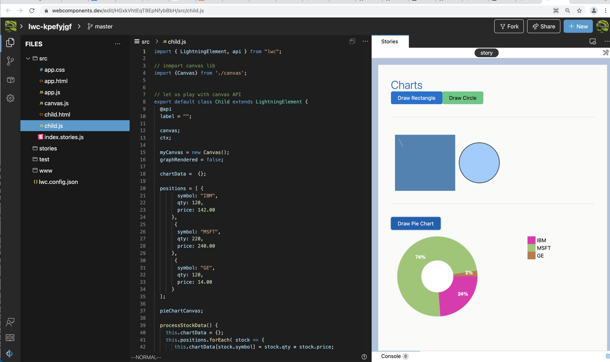

## Charting data

### Playing with HTML Canvas API

- [Playground: Pie Chart the stock positions](https://webcomponents.dev/edit/HGxkVhtEqT8EpNfybBbH/src/child.js)

- [Pie Chart component](https://webcomponents.dev/edit/PZdfXHuUH8sq8ItGTf9t/src/piechart.html)

## Links
- [Lightning Web Chart.js Component](https://salesforcelabs.github.io/LightningWebChartJS/docs/api/chart.html)